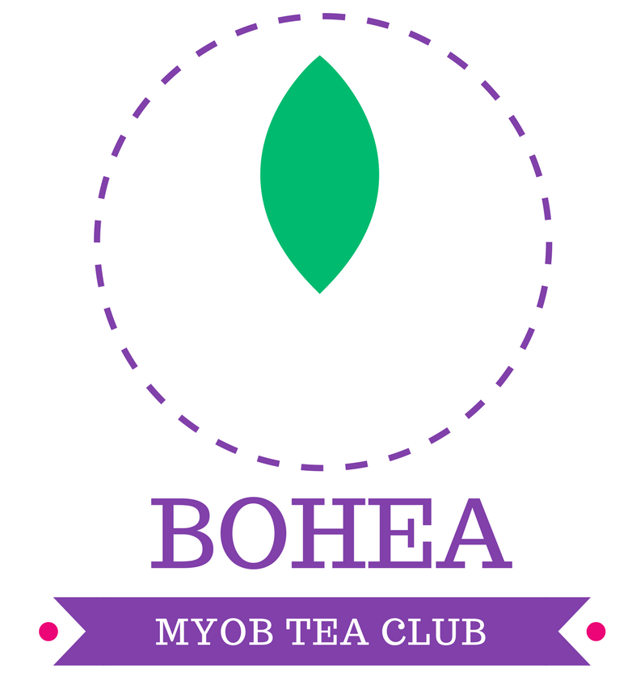
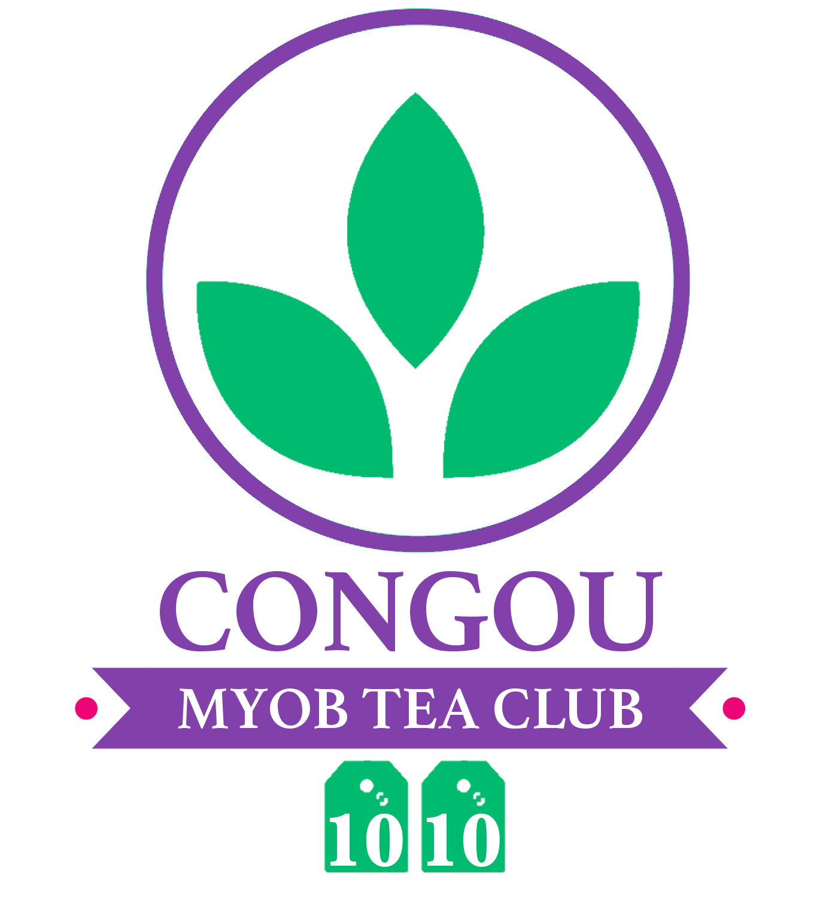
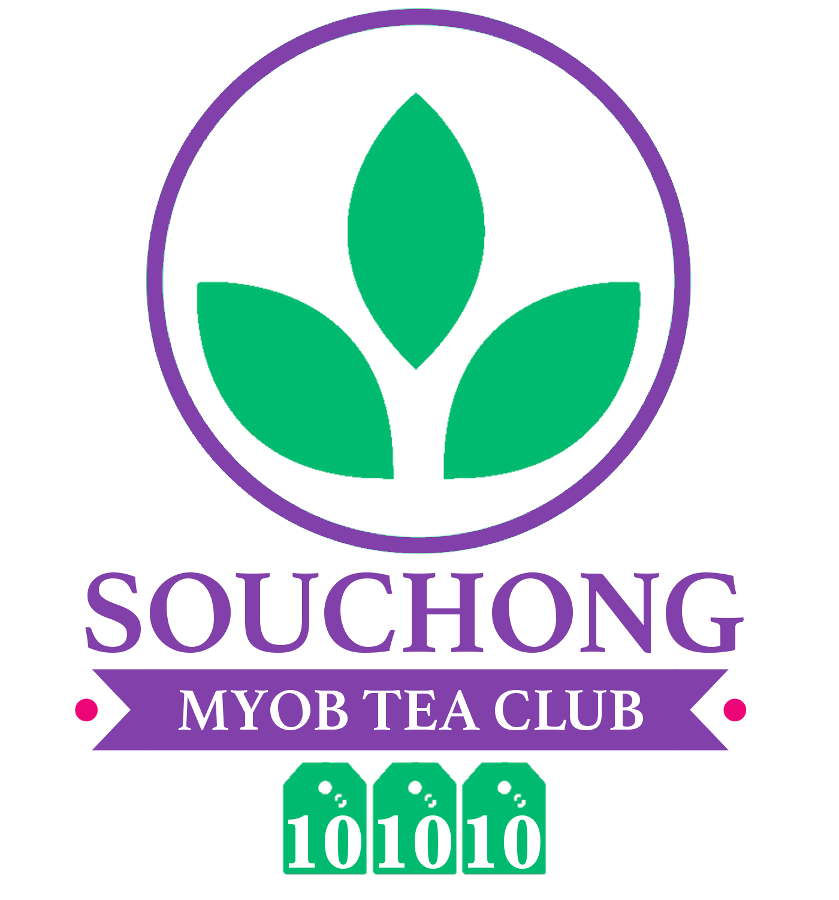
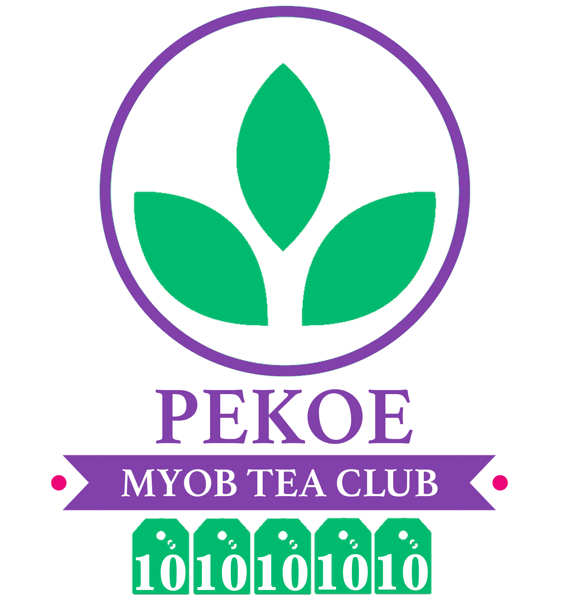
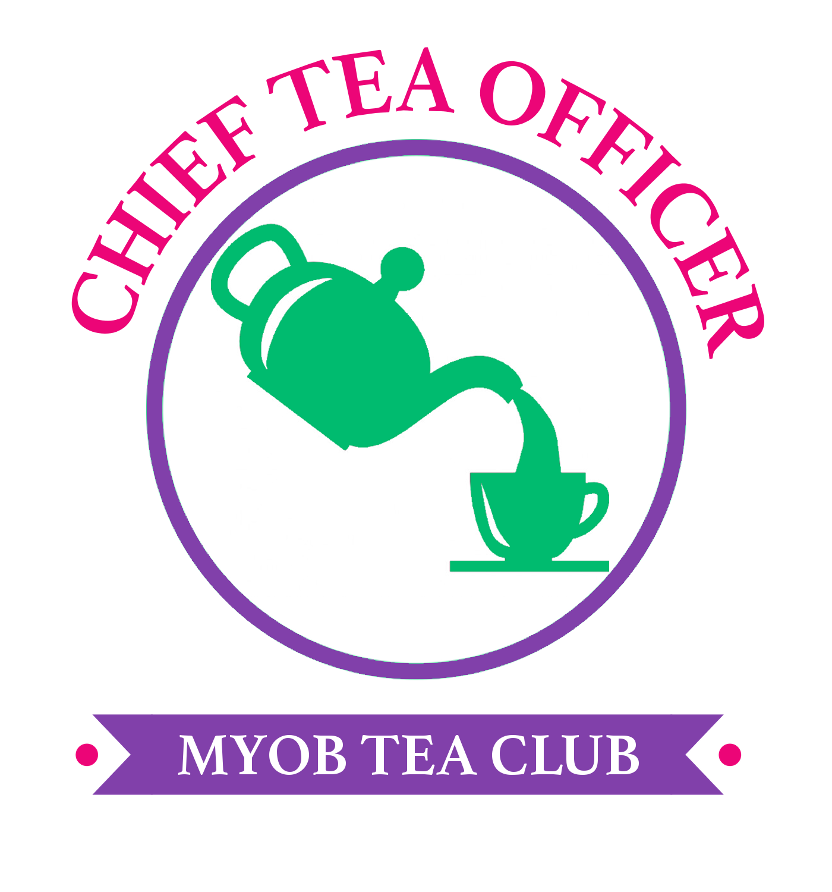

[Home](./README.md) ᛫ [Tea meetings](./MEETINGS.md) ᛫ [Tea collection](./COLLECTION.md)

-----

# Badges of Honour

Inspired by [Tea Leaf Grading] we honour our [MYOB Tea Club] members with the badges below.

## Tea Donation Badges

  
  
  
  

| Level     | Teas donated | Members                                                                 |
|-----------|--------------|-------------------------------------------------------------------------|
| Bohea     | 10           | Gary Butler ᛫ Kate Andrews ᛫ Ivan Pchelnikov ᛫ Amy Dreise ᛫ Louise Brooks |
| Congou    | 20           | Gary Butler ᛫ Kate Andrews                                               |
| Souchong  | 30           | Gary Butler                                                             |
| Pekoe     | 50           | -                                                                       |

## Special Badges

  

| Level             | Description             | Members                      |
|-------------------|-------------------------|------------------------------|
| Chief Tea Officer | Awards badges of honour | Ruslan Kazakov ᛫ Cherry Zhou |

[MYOB Tea Club]: https://github.com/rkazakov/tea-club
[Tea Leaf Grading]: https://en.wikipedia.org/wiki/Tea_leaf_grading
